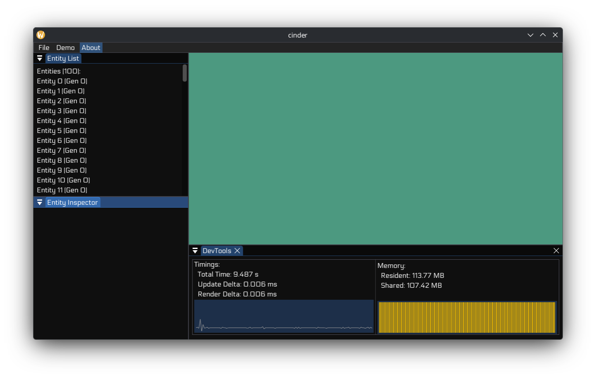

# 🔥 Cinder

   

Game engine I'm building for fun. I can't even keep count on which try this is.
Currently more of a framework than an actual usable engine, but getting there.

Built around SDL3's new GPU abstraction with Slang shaders, uses WAMR for WebAssembly scripting so game logic can be sandboxed and potentially hot-reloaded. Has a layer-based architecture where each subsystem (windowing, GPU, ImGui, WASM) is its own layer that hooks into the main loop. The ECS-ish part lives in the `hex` namespace, handles entity/component storage and system scheduling with a worker pool.

## Dependencies

- [SDL3](https://github.com/libsdl-org/SDL) - windowing, input, GPU abstraction
- [Slang](https://github.com/shader-slang/slang) - shader compiler (needs to be installed separately)
- [WAMR](https://github.com/bytecodealliance/wasm-micro-runtime) - WebAssembly runtime
- [Dear ImGui](https://github.com/ocornut/imgui) - debug UI
- [reflect-cpp](https://github.com/getml/reflect-cpp) - compile-time reflection

## Building

Requires clang 18+ (gcc not tested yet), CMake 4.1+, and Slang installed to `~/.local/bin/slang` (override with `-DSLANG_ROOT_DIR=...`).

```bash
cmake -B build
cmake --build build -j$(nproc)
```

The runtime binary ends up in `build/runtime/cinder_runtime`.

## Project Layout

```
engine/         core library, the actual engine code
  include/      
    layers/     layer implementations (window, gpu, imgui, wasm)
    world/      ECS stuff - entities, components, archetypes
    system/     system scheduling, worker threads
    data/       utility types (time, math, strings)
  src/          implementation files mirror the include structure

runtime/        standalone executable that uses the engine
tests/          catch2 tests
wasm-example-module/  sample wasm module to test scripting
extern/         vendored dependencies
```

## Namespaces

The codebase is split across a few namespaces, partly to keep it well divided, partly to make it sound whimsical and cool.
- `cinder` - host, layers, core types
- `hex` - world, entities, components, systems  
- `prism` - GPU/rendering stuff
- `echo` - ImGui layer, console, I/O, etc.

## Plans

Things I want to get to eventually:

- [ ] Proper asset pipeline (Assimp and SDL surfaces?)
- [ ] Scene graph and serialization with reflect-cpp (Partly doable)
- [ ] Physics - probably Jolt
- [ ] Audio system (OpenAL?)
- [ ] Actually make the editor usable
- [ ] WASM hot reload without restarting
- [ ] Make the WASM components and systems actually do something
- [ ] Proper render graph instead of hardcoded passes
- [ ] Write docs before I forget how everything works
- [ ] Unit tests to some degree
- [ ] Some kind of networking? (low priority)

## Status

It runs, and ECS behaves decently!



## License

MIT
